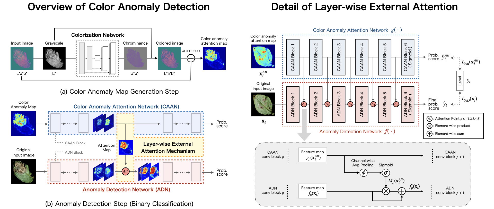
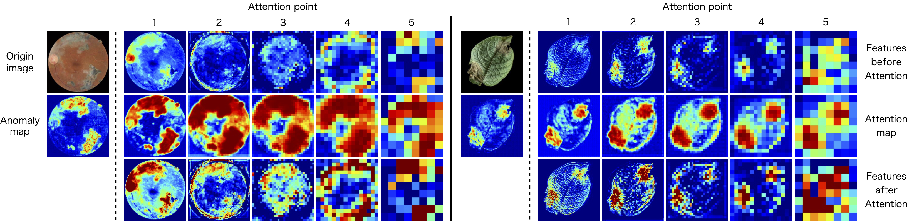

# LEA-Net: Layer-wise External Attention Network

LEA-Net: Layer-wise External Attention Network for Efficient Color Anomaly Detection <br>
[Ryoya Katafuchi](https://github.com/RxstydnR), [Terumasa Tokunaga](https://researchmap.jp/7000007131)

\[[arXiv paper](https://arxiv.org/abs/2109.05493)\]




## Overview

This repository provides the implementation of **LEA-Net (Layer-wise External Attention Network)** for color anomaly detection. Through layer-wise external attention, the formative anomalous regions on the intermediate feature maps can be highlighted. LEA-Net has a role in boosting existing CNN’s anomaly detection performances.

<!--

## Citation

If you use this repository, please cite the following reference:

https://github.com/machine-perception-robotics-group/attention_branch_network
-->

## Enviroment

This is `tf.keras` implementation. Requirements of Tensorflow/Keras version are as follows: 

- Tensorflow : 2.3.0
- Tensorflow-gpu : 2.3.0
- Keras : 2.4.3
- Python : 3.6.10  


## Dataset

In this research, we focus on ***color anomalies***. Following each dataset contains some kind of color anomaly data. Download the dataset to be used for your experiment.

URLs of all datasets are in [Dataset.md](Dataset.md).

**Note: For each dataset, create “Positive” & “Negative" folders and categorize the image data to use our expriment codes.**


## Usage

#### **Training Colorization Network and obtain color anomaly maps.**

5-fold CV dataset containing 1) RGB images, 2) colored images and 3) color anomaly maps are created in the saving folder.

```
(Format)
python colorization.py --dataset <Name of Dataset Folder> --SAVE_PATH <Name of Saving Folder>

(Example) 
python colorization.py --dataset PlantVillage/Potato --SAVE_PATH PlantVillage/Potato
```

or you can run .sh file.

```
sh colorization.sh
```

#### **Training and evaluation of LEA-Net's anomaly detection performance.**

```
(Format)
python anomalydetection.py --dataset <Name of Saving Folder of colorization> --SAVE_PATH <Name of Saving Folder>

(Example) 
python anomalydetection.py --dataset PlantVillage/Potato --SAVE_PATH PlantVillage/Potato
```

or you can run .sh file.

```
sh anomaly_detection.sh
```

For more details of optional arguments for LEA-Net, please see [LEA-Net.md](LEA-Net.md).


## Performances

### Effects of layer-wise external attention 

Visualization of feature maps at attention points before and after the layer-wise external attention.




## License

```
Copyright (c) 2021 Ryoya Katafuchi
This repository is released under the MIT License, see LICENSE.
```

